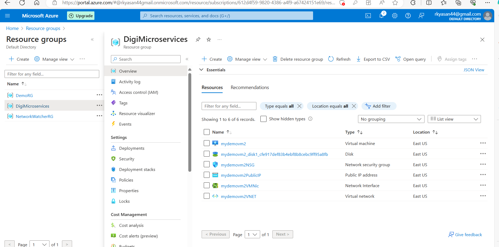

Requesting a Cloud Shell.Succeeded. 
Connecting terminal...

Welcome to Azure Cloud Shell

Type "az" to use Azure CLI
Type "help" to learn about Cloud Shell

Subscription used to launch your CloudShell 612d4f59-9820-4386-a4f9-a67424151e69 is not registered to Microsoft.CloudShell Namespace. Please follow these instructions "https://aka.ms/RegisterCloudShell" to register. In future, unregistered subscriptions will have restricted access to CloudShell service.

Your Cloud Shell session will be ephemeral so no files or system changes will persist beyond your current session.
ram [ ~ ]$ whoami
ram
ram [ ~ ]$ bash
ram [ ~ ]$ az vm list
[]
ram [ ~ ]$ az vm list
[]
ram [ ~ ]$ az subscription list
'subscription' is misspelled or not recognized by the system.

Examples from AI knowledge base:
az account list
Get a list of subscriptions for the logged in account. (autogenerated)

az account show
Get the details of a subscription. (autogenerated)

az account set --subscription mysubscription
Set a subscription to be the current active subscription. (autogenerated)

https://docs.microsoft.com/en-US/cli/azure/account#az_account_list
Read more about the command in reference docs
ram [ ~ ]$ az account list
[
  {
    "cloudName": "AzureCloud",
    "homeTenantId": "d38bc14c-c66c-4273-ab6b-15bdd3e5ba6d",
    "id": "612d4f59-9820-4386-a4f9-a67424151e69",
    "isDefault": true,
    "managedByTenants": [],
    "name": "Ram-freetrail",
    "state": "Enabled",
    "tenantId": "d38bc14c-c66c-4273-ab6b-15bdd3e5ba6d",
    "user": {
      "cloudShellID": true,
      "name": "live.com#rkyasan44@gmail.com",
      "type": "user"
    }
  }
]
ram [ ~ ]$ az account show
{
  "environmentName": "AzureCloud",
  "homeTenantId": "d38bc14c-c66c-4273-ab6b-15bdd3e5ba6d",
  "id": "612d4f59-9820-4386-a4f9-a67424151e69",
  "isDefault": true,
  "managedByTenants": [],
  "name": "Ram-freetrail",
  "state": "Enabled",
  "tenantId": "d38bc14c-c66c-4273-ab6b-15bdd3e5ba6d",
  "user": {
    "cloudShellID": true,
    "name": "live.com#rkyasan44@gmail.com",
    "type": "user"
  }
}
ram [ ~ ]$ az resourcegroup show
'resourcegroup' is misspelled or not recognized by the system.
Did you mean 'resource' ?

Examples from AI knowledge base:
az resource list
List resources. (autogenerated)

az group create --location westus --resource-group MyResourceGroup
Create a new resource group in the West US region.

az group list --query "[?location=='westus']"
List all resource groups located in the West US region.

https://docs.microsoft.com/en-US/cli/azure/resource#az_resource_list
Read more about the command in reference docs
ram [ ~ ]$ az resourcegroup list
'resourcegroup' is misspelled or not recognized by the system.
Did you mean 'resource' ?

Examples from AI knowledge base:
az resource list
List resources. (autogenerated)

az group create --location westus --resource-group MyResourceGroup
Create a new resource group in the West US region.

az group list --query "[?location=='westus']"
List all resource groups located in the West US region.

https://docs.microsoft.com/en-US/cli/azure/resource#az_resource_list
Read more about the command in reference docs
ram [ ~ ]$ az group list
[
  {
    "id": "/subscriptions/612d4f59-9820-4386-a4f9-a67424151e69/resourceGroups/DigiMicroservices",
    "location": "eastus",
    "managedBy": null,
    "name": "DigiMicroservices",
    "properties": {
      "provisioningState": "Succeeded"
    },
    "tags": {
      "Environment": "Production",
      "Exam": "Yes"
    },
    "type": "Microsoft.Resources/resourceGroups"
  }
]
ram [ ~ ]$ az group create --location eastus --resource-group EnvironmentGroup
{
  "id": "/subscriptions/612d4f59-9820-4386-a4f9-a67424151e69/resourceGroups/EnvironmentGroup",
  "location": "eastus",
  "managedBy": null,
  "name": "EnvironmentGroup",
  "properties": {
    "provisioningState": "Succeeded"
  },
  "tags": null,
  "type": "Microsoft.Resources/resourceGroups"
}

ram [ ~ ]$ az group create --location eastus --resource-group EnvironmentGroup --tags [env=dev type=service]
{
  "id": "/subscriptions/612d4f59-9820-4386-a4f9-a67424151e69/resourceGroups/EnvironmentGroup",
  "location": "eastus",
  "managedBy": null,
  "name": "EnvironmentGroup",
  "properties": {
    "provisioningState": "Succeeded"
  },
  "tags": {
    "[env": "dev",
    "type": "service]"
  },
  "type": "Microsoft.Resources/resourceGroups"
}
ram [ ~ ]$ az group create --location eastus --resource-group EnvironmentGroup --tags env=dev type=service
{
  "id": "/subscriptions/612d4f59-9820-4386-a4f9-a67424151e69/resourceGroups/EnvironmentGroup",
  "location": "eastus",
  "managedBy": null,
  "name": "EnvironmentGroup",
  "properties": {
    "provisioningState": "Succeeded"
  },
  "tags": {
    "env": "dev",
    "type": "service"
  },
  "type": "Microsoft.Resources/resourceGroups"
}
ram [ ~ ]$ az group list
[
  {
    "id": "/subscriptions/612d4f59-9820-4386-a4f9-a67424151e69/resourceGroups/DigiMicroservices",
    "location": "eastus",
    "managedBy": null,
    "name": "DigiMicroservices",
    "properties": {
      "provisioningState": "Succeeded"
    },
    "tags": {
      "Environment": "Production",
      "Exam": "Yes"
    },
    "type": "Microsoft.Resources/resourceGroups"
  },
  {
    "id": "/subscriptions/612d4f59-9820-4386-a4f9-a67424151e69/resourceGroups/EnvironmentGroup",
    "location": "eastus",
    "managedBy": null,
    "name": "EnvironmentGroup",
    "properties": {
      "provisioningState": "Succeeded"
    },
    "tags": {
      "env": "dev",
      "type": "service"
    },
    "type": "Microsoft.Resources/resourceGroups"
  }
]

ram [ ~ ]$ az vm create --name mydemovm2 --resource-group DigiMicroservices --image Ubuntu2204 --generate-ssh-keys
SSH key files '/home/ram/.ssh/id_rsa' and '/home/ram/.ssh/id_rsa.pub' have been generated under ~/.ssh to allow SSH access to the VM. If using machines without permanent storage, back up your keys to a safe location.
{
  "fqdns": "",
  "id": "/subscriptions/612d4f59-9820-4386-a4f9-a67424151e69/resourceGroups/DigiMicroservices/providers/Microsoft.Compute/virtualMachines/mydemovm2",
  "location": "eastus",
  "macAddress": "00-0D-3A-13-9B-97",
  "powerState": "VM running",
  "privateIpAddress": "10.0.0.4",
  "publicIpAddress": "52.170.234.15",
  "resourceGroup": "DigiMicroservices",
  "zones": ""
}
ram [ ~ ]$ 

### Connect to VM
az ssh vm --resource-group DigiMicroservices --vm-name mydemovm2 --subscription 612d4f59-9820-4386-a4f9-a67424151e69

ram [ ~ ]$ az ssh vm --resource-group DigiMicroservices --vm-name mydemovm2 --subscription 612d4f59-9820-4386-a4f9-a67424151e69
OpenSSH_8.9p1, OpenSSL 1.1.1k  FIPS 25 Mar 2021
The authenticity of host '52.170.234.15 (52.170.234.15)' can't be established.
ED25519 key fingerprint is SHA256:2FokNQuyWNoNEFI+PMNxROG8zRVc7OqswPkhc9rgG7o.
This key is not known by any other names
Are you sure you want to continue connecting (yes/no/[fingerprint])? yes
Warning: Permanently added '52.170.234.15' (ED25519) to the list of known hosts.
Learned new hostkey: RSA SHA256:TuQYzfqs+AtgsGdRSFx4O0oN9DOKECj9RjL9I1lszCU
                                                                           Learned new hostkey: ECDSA SHA256:CfxCDQ1GecuvE0ygZnEgwE1BRaWiMV6WtIEYYoouI7k
                                                                                                                                                        Adding new key for 52.170.234.15 to /home/ram/.ssh/known_hosts: ssh-rsa SHA256:TuQYzfqs+AtgsGdRSFx4O0oN9DOKECj9RjL9I1lszCU
                                                                                           Adding new key for 52.170.234.15 to /home/ram/.ssh/known_hosts: ecdsa-sha2-nistp256 SHA256:CfxCDQ1GecuvE0ygZnEgwE1BRaWiMV6WtIEYYoouI7k
                                          Welcome to Ubuntu 22.04.4 LTS (GNU/Linux 6.5.0-1021-azure x86_64)

 * Documentation:  https://help.ubuntu.com
 * Management:     https://landscape.canonical.com
 * Support:        https://ubuntu.com/pro

 System information as of Sat Jun  8 06:10:46 UTC 2024

  System load:  0.15              Processes:             105
  Usage of /:   5.8% of 28.89GB   Users logged in:       0
  Memory usage: 9%                IPv4 address for eth0: 10.0.0.4
  Swap usage:   0%

Expanded Security Maintenance for Applications is not enabled.

42 updates can be applied immediately.
31 of these updates are standard security updates.
To see these additional updates run: apt list --upgradable

Enable ESM Apps to receive additional future security updates.
See https://ubuntu.com/esm or run: sudo pro status

The programs included with the Ubuntu system are free software;
the exact distribution terms for each program are described in the
individual files in /usr/share/doc/*/copyright.

Ubuntu comes with ABSOLUTELY NO WARRANTY, to the extent permitted by
applicable law.

To run a command as administrator (user "root"), use "sudo <command>".
See "man sudo_root" for details.

rkyasan44@gmail.com@mydemovm2:~$ 

